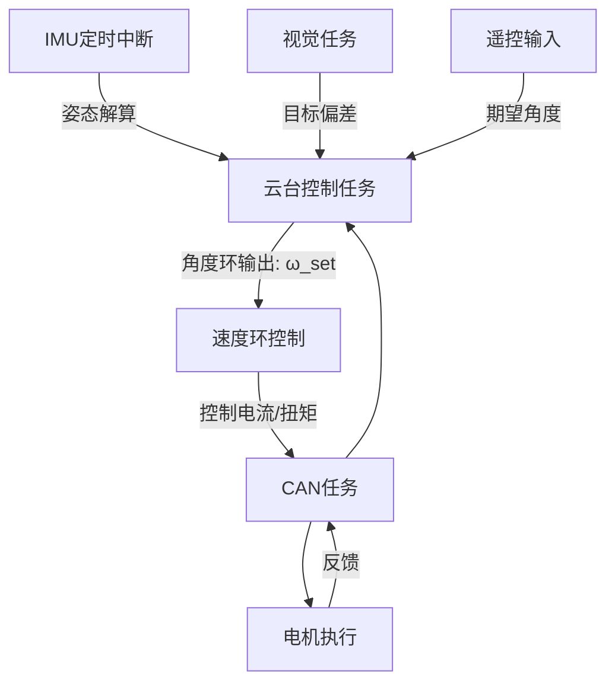

# 📘 二维云台控制系统

本项目基于 **FreeRTOS + CAN 总线 + IMU 定时中断** 实现精细化的二维云台控制，采用 **双环控制（角度环 + 速度环）**，结合视觉与遥控输入，实现目标跟踪与稳定控制。

---

## 🔹当前任务（待完成）

* 1. **CAN收发函数**编写/移植以及封装
* 1. **CAN收发函数**编写/移植以及封装
* 1. **CAN收发函数**编写/移植以及封装
* 1. **CAN收发函数**编写/移植以及封装
* 1. **CAN收发函数**编写/移植以及封装
* 1. **CAN收发函数**编写/移植以及封装

## 🔹 系统主要任务

### 1. **IMU 数据采集**

* 通过 **定时器中断**读取 IMU 原始数据。
* 进行姿态解算（互补滤波 / 卡尔曼滤波），得到 Pitch、Yaw 角度与角速度。
* 为控制环路提供实时反馈。

---

### 2. **目标偏差计算**

* 来自视觉模块。
* 将图像坐标系中的目标位置转化为角度偏差。
* 输出目标相对于云台中心的误差角。

---

### 3. **设定角度来源**

* **遥控输入**：用户手动设定期望角度。
* **视觉输入**：根据目标偏差自动修正期望角度。
* 两者可组合（例如：默认保持遥控，视觉进入自动跟踪模式时接管）。

---

### 4. **外环控制（角度环）**

* 输入：期望角度与当前角度的差值。
* 输出：期望角速度。
* 控制器：PID（低带宽，防止大幅振荡）。

---

### 5. **内环控制（速度环 / 角速度环）**

* 输入：期望角速度与 IMU 角速度差值。
* 输出：电机电流 / PWM 指令。
* 控制器：高速 PID（高带宽，提升动态响应和抗扰能力）。

---

### 6. **输出到电机**

* 控制命令通过 **CAN 总线** 发送到电机驱动。
* CAN 任务在 RTOS 中运行，负责收发电机控制帧与反馈数据。

---

### 7. **任务调度与结构优化**

* **IMU 定时中断**：高优先级，保证姿态解算实时性。
* **云台控制任务（1kHz）**：核心控制环，运行角度环 + 速度环控制逻辑。
* **CAN 通信任务**：负责电机命令发送与状态接收。
* **视觉任务（30Hz）**：负责目标检测与偏差计算。
* **延时/定时**：通过 FreeRTOS `vTaskDelayUntil` 保证任务周期稳定。

---

## 🔹 系统架构图（逻辑）

