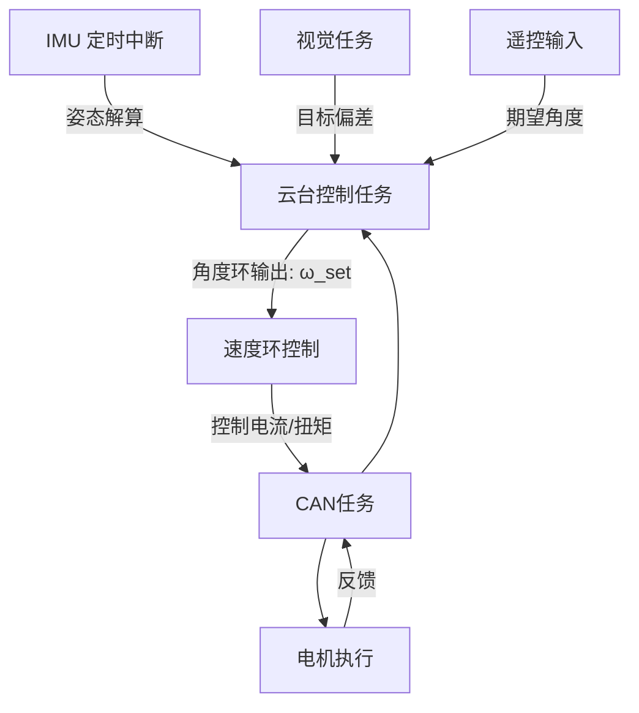

# 📘 二维云台控制系统（2D Gimbal Control System）

本项目基于 **FreeRTOS + CAN 总线 + IMU 定时中断**，实现精细化的二维云台控制。系统采用 **双环控制（角度环 + 速度环）**，结合视觉和遥控输入，实现目标跟踪和稳定控制。

//test
---

## 🔹 当前待完成任务

* PID 运算逻辑（开发中）
* IMU 初始化与姿态角读取（依赖云台归中完成）
* 调用视觉传回的目标数据进行云台控制

---

## 🔹 系统功能概览

### 1. IMU 数据采集

* 通过 **定时器中断**读取 IMU 原始数据
* 姿态解算（互补滤波 / 卡尔曼滤波），得到 Pitch、Yaw 角度与角速度
* 为控制环路提供实时反馈

---

### 2. 目标偏差计算

* 输入来源：视觉模块+虚拟串口
* 将图像坐标系中的目标位置转换为角度偏差
* 输出目标相对于云台中心的误差角

---

### 3. 期望角度设定

* **遥控输入**：用户手动设定期望角度
* **视觉输入**：根据目标偏差自动修正期望角度
* 支持两者组合，例如：默认保持遥控，视觉模式启动时接管

---

### 4. 外环控制（角度环）

* 输入：期望角度与当前角度差值
* 输出：期望角速度
* 控制器：低带宽 PID，防止大幅振荡

---

### 5. 内环控制（速度环 / 角速度环）

* 输入：期望角速度与 IMU 测得角速度差值
* 输出：电机 PWM / 电流指令
* 控制器：高速 PID，高带宽，提升动态响应与抗扰能力

---

### 6. 电机控制输出

* 通过 **CAN 总线**发送控制命令到电机驱动
* CAN 任务负责收发电机控制帧与反馈数据

---

### 7. 任务调度与系统结构

* **IMU 定时中断**：高优先级，保证姿态解算实时性
* **云台控制任务**：执行角度环 + 速度环控制逻辑
* **CAN 通信任务**：电机命令发送与反馈接收
* **视觉任务**：目标检测与偏差计算
* 使用 `vTaskDelayUntil` 保证任务周期稳定

---

## 🔹 云台控制逻辑流程

1. **反馈读取**：将当前云台状态与传感器反馈存入结构体
2. **归中检测**：根据标志位判断是否需要归中，未归中时执行归中控制
3. **限幅处理**：角度超过预设范围时进行限幅修正
4. **PID 运算**：以姿态角 + 增量角度（add）进行 PID 计算，得到最终输出
5. **CAN 输出**：通过 CAN 任务发送给电机执行

---

## 🔹 系统涉及角度说明

| 角度类型       | 描述                     |
| ---------- | ---------------------- |
| 电机机械角度     | 电机旋转实际位置               |
| IMU 姿态角    | IMU 解算得到的 Pitch/Yaw 角度 |
| 遥控/PC 输入角度 | 用户设定的期望角度（用于加法增量计算）    |
| 中值角度       | 云台归中时校准的基准角度           |
| 绝对角度       | 当前反馈角度（机械角 + 姿态角）      |
| 相对角度       | 绝对角度与中值角度之差（取最小正值）     |
| 误差角度       | 期望角度与当前角度差值，用于 PID 运算  |

**限幅逻辑示例**：

* 中值角度：3000 ~ 6000
* 当相对角度 + add 超出范围时，进行回振或限制
* 设置角度为中值角度以保证安全

---

## 🔹 待解决问题 / 注意事项

1. 云台归中顺序：先转 Yaw 轴还是 Pitch 轴？两轴同时归中是否安全？
2. IMU 上电姿态角默认归零，归中后会有初始偏移值，是否需要校正？

---

## 🔹 系统逻辑图

